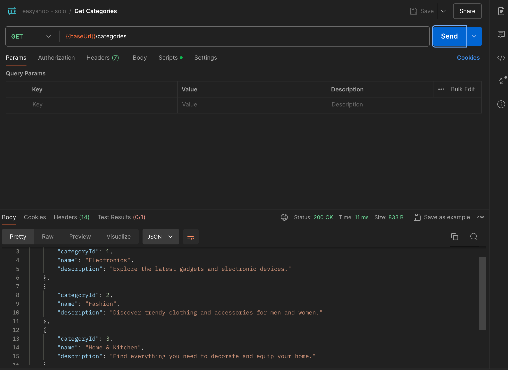
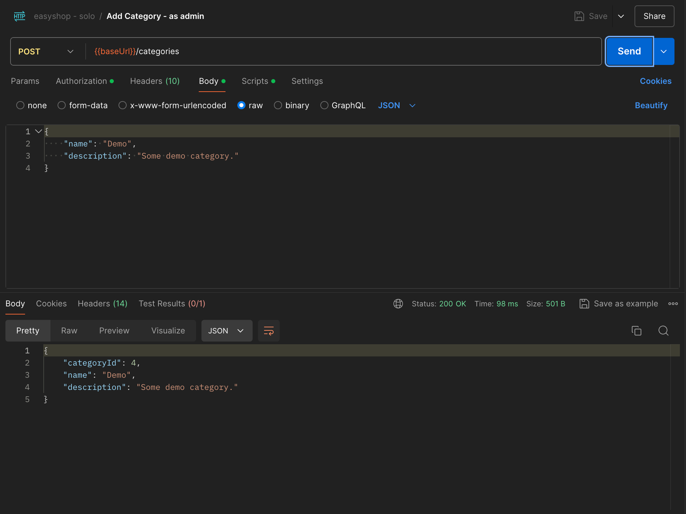
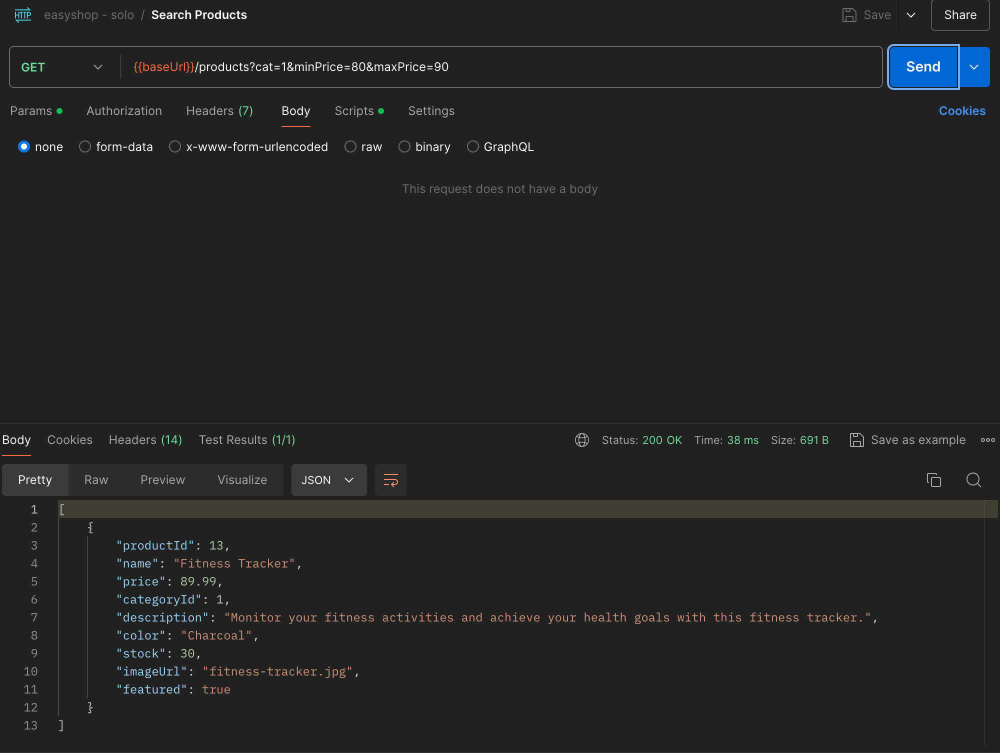
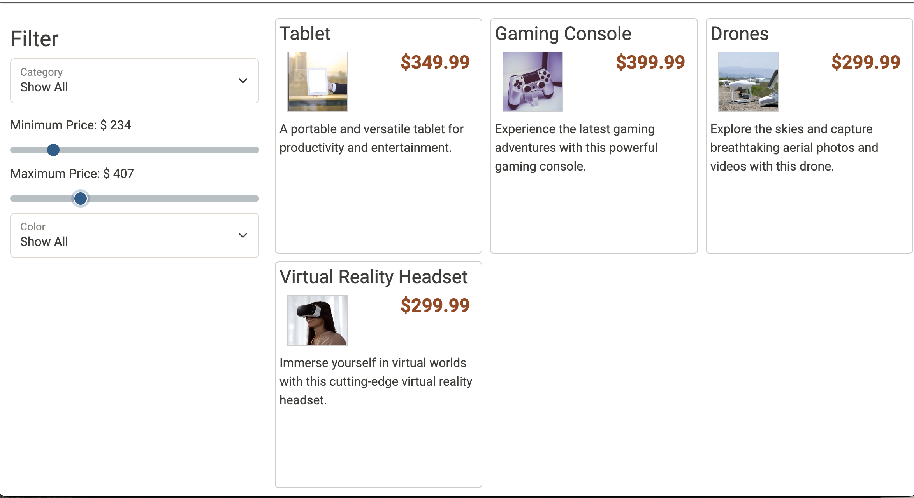
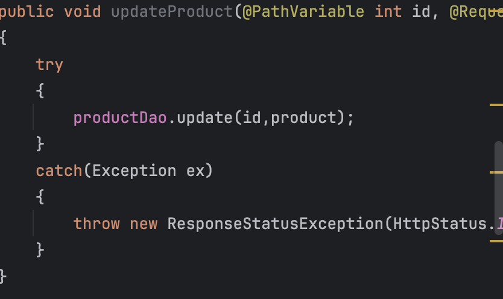
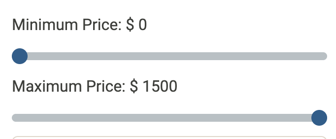

# Easyshop 
___
### Overview
Easyshop is an existing  E-commerce application built with Spring Boot and MySql on the backend. For this project I acted as backend developer implementing new features and fixing bugs.
___
## Features Implemented
___
### Category Management
Implemented complete CRUD operations for categories:
* GET /categories: View all categories.

* GET /categories{id}: View a category by ID.
* GET /categories/{id}/products: View all products from a given category.
* POST /categories: Creates a new category.
* PUT /categories/{id}: Updates an existing category.
* DELETE /categories/{id}: Deletes a category.
Editing categories can only be done by an admin

### Products Management
* GET /products: View all products.
* GET /products{id}: View a product by ID.
* POST /products: Creates a new product.
* PUT /products/{id}: Updates an existing product.
* DELETE /products/{id}: Deletes a product.
  
## Bug Fixes
* Corrected Search and Filter logic to return proper products based on search criteria.

* Identified the cause of duplicate product entries.

## Interesting piece of Code 
Fixed the maximum price on the frontend 

